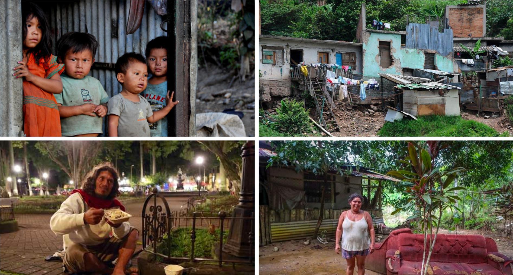
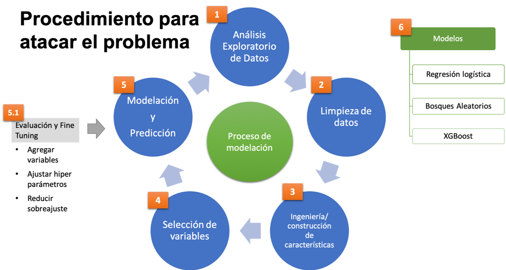
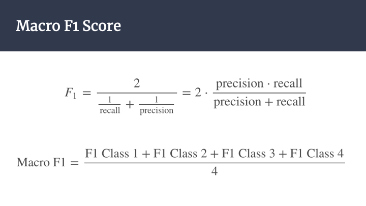
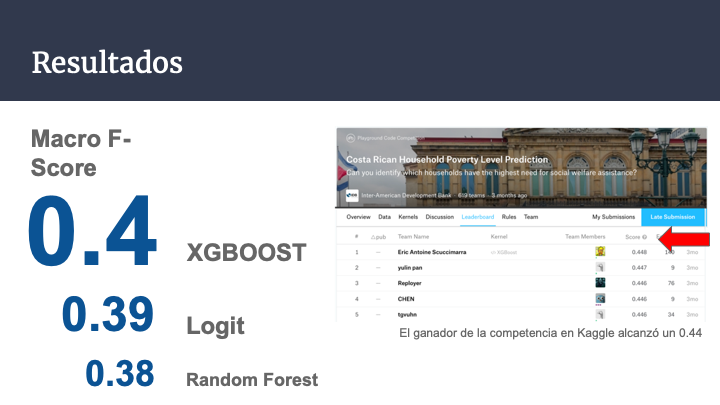
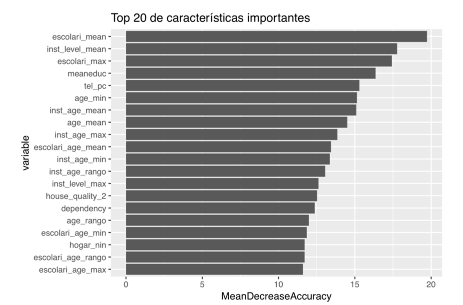

# Predicting household poverty in Costa Rica
## Inter-American Development Bank (IDB) Kaggle competition

### Problem

The level of poverty in Costa Rica has increased such that in 2018 21% of households live in these conditions. The government and the Inter-American Development Bank are working to tackle poverty with social programs to attend the need of the poor.

However, financial resources are limited, and it is very difficult to allocate social programs to the people that need them the most. For instance, individuals living in poverty have a hard time to demonstrate that they qualify to such programs, as they cannot easily provide records of their income and expenditures.

In this sense, the IDB is looking to use machine learning algorithms to help the Costa Rican government maximize the allocation of social programs' resources using household information.

### Objective

To develop a machine learning algorithm that can predict household poverty level using household and occupant’s information.

### Data

The data was provided by the IDB through the [Kaggle competition](https://www.kaggle.com/c/costa-rican-household-poverty-prediction).

Two datasets were provided where each row contains information about household occupant. The columns represent 142 features of occupants or household:

- train set: 9,557 occupants (rows)
- test set 23,856 occupants (rows)

The target variable is an ordinable variable indicating groups of income level.

- 1 = extreme poverty 
- 2 = moderate poverty 
- 3 = vulnerable households 
- 4 = non-vulnerable households

### Methodology

The project followed a typical machine learning pipeline:

1. Exploratory data analysis
2. Data cleaning
3. Feature construction and feature engineering
4. Feature selection
5. Modelling
6. Prediction
7. Evaluation
8. Fine tuning

The algorithms that were used for this project were:

- Logistic regression
- Random forests
- Xgboost

The predictions are for each household. Nonetheless, predictions have to be organized by household occupant. This means that if household 0001 has A,B,C,D occupants, each of them share the same household poverty classification. To score the test set, Kaggle only takes into account household heads.

The evaluation metric is the Macro F-Score.

### Tools

The exploratory data analysis and the machine learning models were fitted using R.

### Results 

The best model was an XGBOOST with 0.4 F-Macro Score, followed by a 0.39 Logistic Regression and a 0.38 Random Forest.

The winner of the competition reached a 0.44 F-Macro Score.

The top 20 predictive variables according to their feature importance were related to education, age, house quality materials, occupant's economic dependency, electronics and children.

### Repository's Index

* Deliverables
	+ final_report.pdf: **FINAL REPORT**
	+ final_presentation.pdf: Executive presentation
* Code
	+ final_project.Rmd: Markdown containing **THE CODE OF THE PROJECT.**

* Data
	+ data: Original datasets from kaggle
		- train.csv
		- trest.csv

* Predictions
	+ sample_submission.csv: Text file containing the predictions uploaded to kaggle

* Figures
	+ Directory containing figures for presentations.
